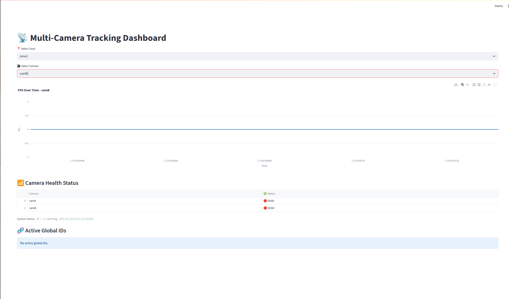
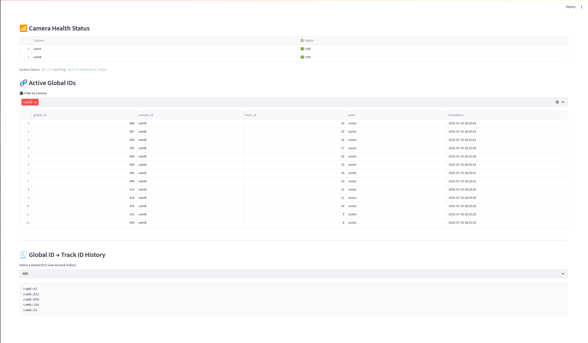

# 🧠 Multi-Camera Tracking Dashboard (MCT)

Real-time analytics dashboard for tracking people across multiple cameras using NVIDIA DeepStream, Redis, and Qdrant.

> 🔍 Global Person Tracking + ⚡ FastAPI API + 📊 Live Dashboard = 🧬 Smart Surveillance




---

## 📦 Components

| Service       | Description                                           |
|---------------|-------------------------------------------------------|
| 🛰️ `deepstream`  | Zone-wise pipelines for real-time object tracking    |
| 🧬 `global_id_service` | Embedding-based Global ID assignment via Redis + Qdrant |
| 🖥️ `dashboard`   | FastAPI + Streamlit UI for real-time analytics      |
| 🧠 `qdrant`      | Vector database for embedding similarity search     |
| 💾 `redis`       | Caching layer for track history & metadata          |

---

## 🚀 Features

- ✅ Real-time Global ID assignment across cameras
- 📈 Per-camera FPS monitoring
- 📦 Redis-backed cache and Qdrant vector DB
- 🔁 Auto-refreshing dashboard with live stats
- 🌐 RESTful FastAPI endpoints
- 🔄 Streamlit dashboard with camera filtering
- 🚦 Camera Health (LIVE / DEAD) with FPS logs
- 🧭 Track history inspection by Global ID

---

## 🐳 Docker Setup

### 🛠️ Build & Run

```bash
docker-compose up --build
Runs the following services:

Service	URL
🧠 Qdrant	http://localhost:6333
💾 Redis	redis://localhost:6379
🚀 FastAPI	http://localhost:8088
📊 Dashboard	http://localhost:8501

📂 Project Structure
pgsql
Copy
Edit
.
├── dashboard.py             # Streamlit UI
├── api_server.py            # FastAPI backend
├── Dockerfile               # Unified build for API + Dashboard
├── docker-compose.yml       # Multi-service orchestration
├── app/
│   └── transition_graph.py  # Zone-camera mapping logic
├── global_id_service/
│   ├── id_manager.py        # Global ID logic
│   ├── cache_instance.py    # Redis wrapper
│   └── qdrant_backend/      # Qdrant similarity matching
├── requirements.txt         # Python dependencies
└── doc/
    └── dashboard_screenshot.png
🔍 Global ID Matching Flow
🎥 A person gets a track_id in a camera pipeline

📐 Extracted embedding is checked in Qdrant for similar identity

🆕 New global_id assigned if no match found

🔁 Redis stores:

Active track_id ↔ global_id

Global ID history

Zone metadata

json
Copy
Edit
{
  "global_id": 42,
  "camera_id": "camA",
  "track_id": "12",
  "zone": "Zone1",
  "timestamp": 1753016101.23
}
🛠️ Development Notes
Run Services Individually
bash
Copy
Edit
# Run FastAPI
uvicorn api_server:app --reload --port 8088

# Run Streamlit Dashboard
streamlit run dashboard.py
Update Dependencies
bash
Copy
Edit
pip freeze > requirements.txt
📸 Dashboard Preview
Add your dashboard screenshot to:

bash
Copy
Edit
doc/dashboard_screenshot.png
It will automatically show at the top of this README.

🧠 Credits
Special thanks to the open-source technologies powering this system:

🎥 NVIDIA DeepStream

💾 Redis

🧠 Qdrant

💬 ChatGPT – for guidance and code assistance

🧑‍💻 Author
Debjit
Machine Learning Engineer | Vision & Tracking Systems

📄 License
This project is licensed under the MIT License.